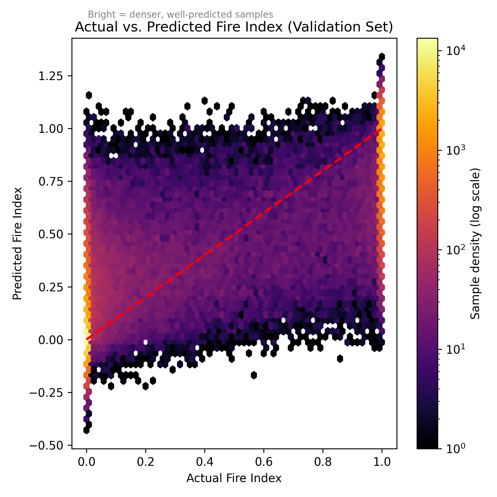
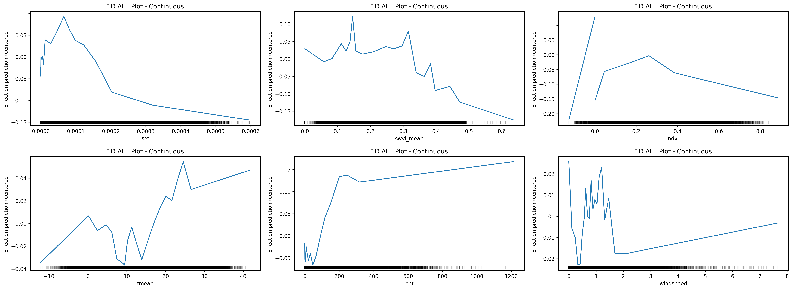
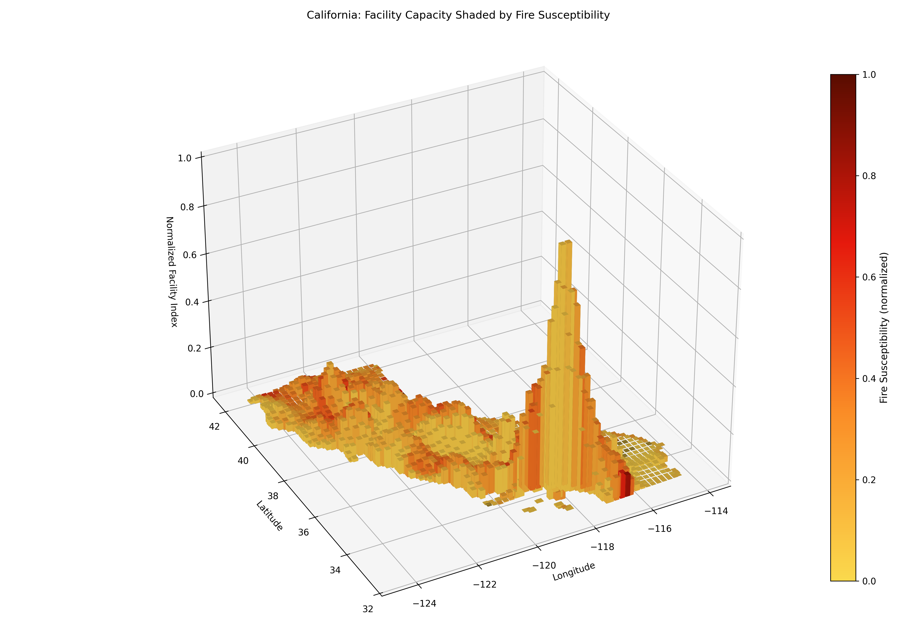

# Stacked Ensemble Modeling of California Wildfire Susceptibility

This repository contains a modular and fully reproducible system for constructing a 1-km–resolution wildfire 
susceptibility model for California. The project integrates climate variables (precipitation, mean temperature), 
wind and soil moisture, vegetation profiles, NDVI, road density, topography, and historical wildfire perimeters, 
and aggregates them into a unified spatiotemporal dataset (1981–2023). 

A stacked ensemble model is then trained to predict tile-level wildfire susceptibility.

In addition to prediction, the system includes a diagnostic workflow that evaluates how well predicted susceptibility 
aligns with the spatial distribution of fire-related facilities, enabling resource–risk comparison and mismatch analysis. 
This is done via analyzing the correlation between the predicted fire susceptibility and summarized facility index.

---

## 🔧 Highlights

- End-to-end geospatial preprocessing pipeline  
- 1-km statewide tiling system reused across all modules  
- Modular dataset integration (climate, vegetation, NDVI, DEM, roads, wind/soil)  
- Cleaned and tiled historical wildfire perimeter dataset  
- Stacked ensemble wildfire susceptibility model  
- Resource–risk discrepancy analysis and map generation  
- Fully documented pipeline with reproducibility instructions

---

## 📊 Results Preview

### **Model Performance**

### **ALE Feature Contributions**

### **3D Fire Susceptibility - Facility Index Shaded by Fire Index**

## 📦 Data Acquisition

This project **does not bundle raw datasets** because of size restrictions.  
You must download the required datasets manually or through their official APIs.
👉Check this guide for full instructions: [Data Acquisition Instructions](docs/data.md)

### **Datasets Required**
- **California Boundary**
- **PRISM Climate Data** (precipitation, tmean)  
- **ERA5-Land Wind & Soil Moisture**  
- **NLCD Land Cover**
- **USGS National Elevation Dataset (DEM)**  
- **TIGER/Line Road Centerlines**  
- **California Interagency Fire Perimeter History**  
- **Facility/FIRESCOP maps** (for discrepancy analysis)

### *Detailed descriptions:*
- **Features dictionary:**-> [Features](docs/features.md)

---

## 🖥️ Model Design
Architecture: Stacked Learning
Base Learners: LightGBM, XGBoost,CatBoost, MLP Regressor
Meta Learner: Ridge Regression
Optimizer: Optuna

---

## 🧭 Pipeline Overview

The codebase is organized into small, isolated modules under `src/`.  
Each module can be run independently and produces intermediate datasets that feed later stages.
👉Check this guide for a general running walkthrough: [Project Walkthrough](docs/walkthrough.md)

### **1. Tiling**
Generates a 1-km statewide grid, clipped to California, and produces:
- `ca_tiles_1km.shp`  
- tile-lookup rasters

### **2. Climate (Precipitation / Temperature)**
- Loads raw PRISM `.bil` data  
- Clips, upsamples to tile resolution, tiles monthly values  
- Produces:
  - `ppt_long.parquet`
  - `tmean_long.parquet`

### **3. Wind & Soil Moisture**
- ERA5-Land aggregated and tiled  
- Year–month summaries aligned to the same tile grid

### **4. NDVI**
- Loads annual NDVI composites  
- Tiles and joins to tile grid

### **5. Topography**
- Elevation, slope, aspect (from DEM)  
- Tiled to 1-km grid

### **6. Road Density**
- TIGER/Line roads  
- Line-length density aggregated inside tiles

### **7. Wildfire Perimeters**
- Cleans raw perimeter shapefile  
- Intersects each fire with affected tiles  
- Produces:
  - `fire_events_tile_year.parquet`

### **8. Modeling**
- Loads all processed datasets  
- Performs annual merges  
- Trains stacked ensemble  
- Saves predictions and model artifacts

### **9. Resource–Risk Discrepancy**
- Compares final susceptibility scores with facility coverage  
- Produces correlation metrics, maps, and mismatch diagnostics

## **📊 Results Summary**
Model Performance (Validation Set)

| Metric            | Value    |
|-------------------|----------|
| **RMSE**          | *0.2289* |
| **MAE**           | *0.1559* |
| **R² Score**      | *0.7148* |
| **MBE**           | *-0.001* |

Resource–Risk Alignment Diagnostics

| Alignment Metrics (Fire vs. Facility) | Value      |
|---------------------------------------|------------|
| **Spatial Pearson**                   | *0.086*    |
| **Regression Slope**                  | *0.1273*   |
| **Mutual Information**                | *0.027*    |

## **📃Conclusion**
The alignment diagnostics indicate that California’s current fire-related facility distribution only weakly corresponds 
to modeled wildfire susceptibility. This indicates substantial opportunity for strategic repositioning or augmentation 
of fire-related resources, particularly in high-risk areas that currently exhibit low coverage.